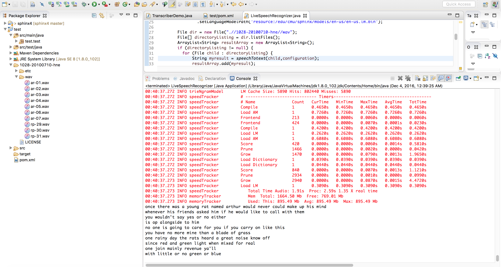

# Speech to Text
Simple repo experimenting with speech2text following [this](http://cmusphinx.sourceforge.net/wiki/)

# Input
A bunch of .wav files exist under the folder "1028-20100710-hne". Click each wav file and hear to the audio first.

# How

- Checkout this repo
- Import into eclipse (or your favorite java IDE)
- Run as - Maven clean compile install
- Run the main program "TranscriberDemo.java" (In eclipse Right click and Run as)
- The output should be the text you'd expect
- The file Untitled.wav was recorded by me to test the program. Unfortunately the library did not convert it well :(
  
  
    
  
# More Resources

- [Sphinx4](http://cmusphinx.sourceforge.net/wiki/tutorialsphinx4)
- [Sample Input Wav files](http://www.repository.voxforge1.org/downloads/SpeechCorpus/Trunk/Audio/Main/16kHz_16bit/)

